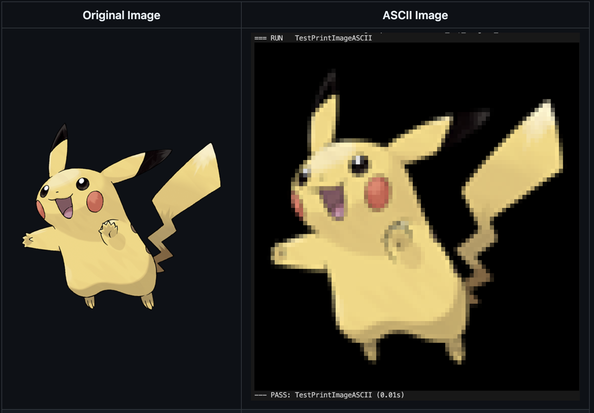

Check the source code in [:material-github: github repo](https://github.com/1-ashraful-islam/image2ascii) or [Read More :material-arrow-down-box:](#project-description).

## Project Description

As I was working on the Pokédex CLI project, I wanted to add the pokémon's image in the terminal interface. I pair-programmed with GPT4 to create a simple image to ascii art converter that allows displaying color images of pokémon in the terminal. The project is written in Go and uses half block unicode characters to represent the image.

Since the package returns the ASCII image as a slice of strings, you can easily print it to the terminal or save it to a file. It is also possible to have your own texts printed either to the right or left of the image by appending the text to the slice of strings.

Inspiration for this package came from [image-to-ascii-art](https://github.com/Sayutizxc/image-to-ascii-art), [ascii-image-converter](https://github.com/TheZoraiz/ascii-image-converter)

